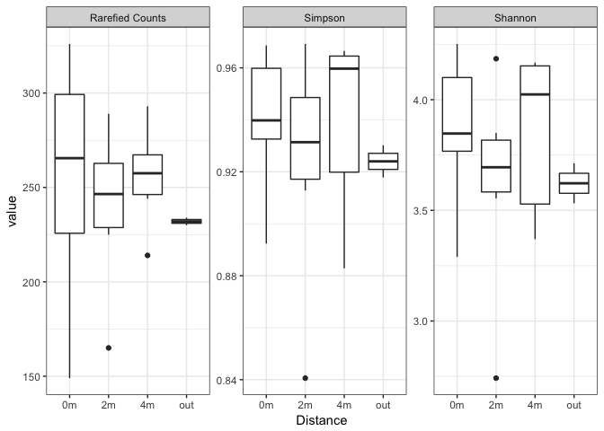
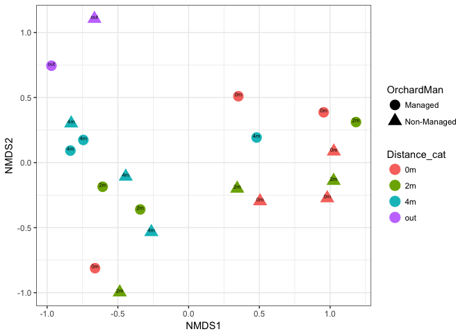
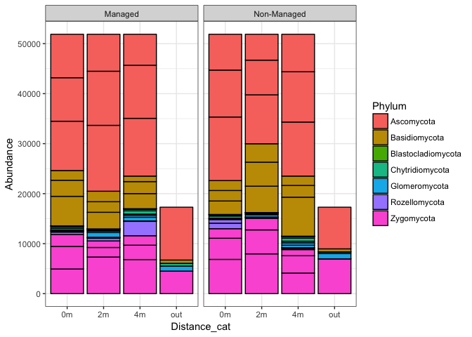
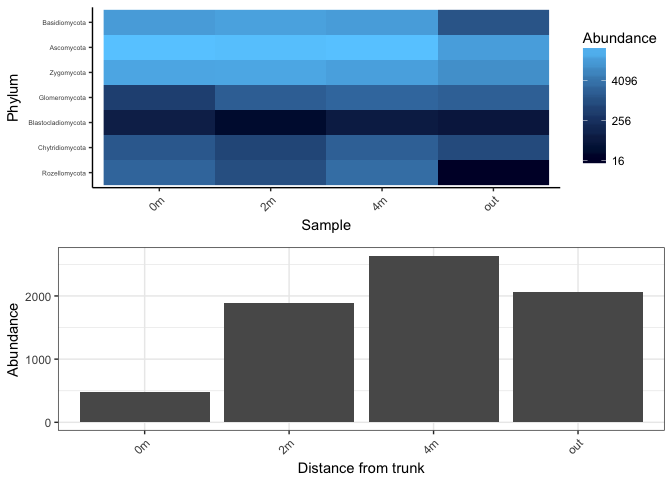
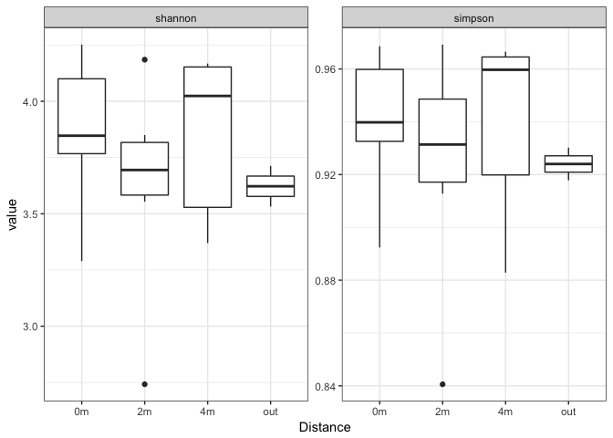

Some of the following code was adapted from the EDAMAME workshop at Michigann State University \* Found here: <https://github.com/raleva/Edamame_phyloseq/blob/master/Edamame_phyloseq.Rmd>

I include this header at the top of all code I write.

``` r
rm(list = ls(all=TRUE)) # removes all variables in the global environment so you start fresh

Sys.time() # prints out the time and date you ran the code

options(scipen = 999) # stops anything from being in scientific notation
```

Loading data: you need the biom file, the mapping file, and the taxonomy file

``` r
#Loading the mapping file
samp_dat <- read.table("../data/input_files/mapping.txt", header = F)
colnames(samp_dat) <- c("SampleID", 
                        "BarcodeSequence",  
                        "LinkerPrimerSequence", 
                        "Region",   
                        "barcodenumb",  
                        "groups",   
                        "OrchardMan",   
                        "Rep",  
                        "Distance_cat", 
                        "Distance_meters",  
                        "group_m",  
                        "group",    
                        "Description")
rownames(samp_dat) <- samp_dat$SampleID #row names must match OTU table headers
SAMP <- sample_data(samp_dat)

# biom file
biom <- import_biom("../data/input_files/R1_otu_table_tax_json.biom", header=T)
OTU <- otu_table(biom, taxa_are_rows = TRUE)

# taxonomy file
taxonomy<-read.table("../data/input_files/R1_taxonomy_otutaxout__RDP.txt", sep="\t", header=F)
```

This reads the taxonomy object and puts it into a better format for R to handle

``` r
tax<-as.character(taxonomy$V2)
head(tax)
```

    ## [1] "k__Fungi;p__Zygomycota;c__Mortierellomycotina_cls_Incertae_sedis;o__Mortierellales;f__Mortierellaceae;g__Mortierella"                                      
    ## [2] "k__Fungi;p__Ascomycota;c__Leotiomycetes;o__Helotiales;f__Helotiales_fam_Incertae_sedis;g__Tetracladium"                                                    
    ## [3] "k__Fungi;p__Zygomycota;c__Mortierellomycotina_cls_Incertae_sedis;o__Mortierellales;f__Mortierellaceae;g__Mortierella;s__Mortierella_elongata_SH180118.07FU"
    ## [4] "k__Fungi;p__Ascomycota;c__Sordariomycetes;o__Hypocreales;f__Nectriaceae"                                                                                   
    ## [5] "k__Fungi;p__Basidiomycota;c__Tremellomycetes;o__Tremellales;f__Tremellales_fam_Incertae_sedis;g__Cryptococcus;s__Cryptococcus_terricola_SH190017.07FU"     
    ## [6] "k__Fungi;p__Basidiomycota;c__Tremellomycetes;o__Cystofilobasidiales;f__Cystofilobasidiaceae;g__Guehomyces"

``` r
#root<-NA
Kingdom<-NA
Phylum<-NA
Class<-NA
Order<-NA
Family<-NA
Genus<-NA
Species<-NA

linaean<-data.frame(Kingdom,Phylum,Class,Order,Family,Genus,Species)

for (i in 1:dim(taxonomy)[1]) {
  split.tax<-strsplit(tax[i],split=c(";"))
  linaean[i,1]<-substr(split.tax[[1]][1], 4,30)
  linaean[i,2]<-substr(split.tax[[1]][2], 4,30)
  linaean[i,3]<-substr(split.tax[[1]][3], 4,30)
  linaean[i,4]<-substr(split.tax[[1]][4], 4,30)
  linaean[i,5]<-substr(split.tax[[1]][5], 4,30)
  linaean[i,6]<-substr(split.tax[[1]][6], 4,30)
  linaean[i,7]<-substr(split.tax[[1]][7], 4,30)
}
##

# remove underscore before taxon name
rownames(linaean) <- taxonomy$V1
for(i in 2:7){
linaean[,i] <- gsub("_","",linaean[,i])
}

TAX <- tax_table(as.matrix(linaean))
```

Read in your OTU, TAX and SAMP objects into phyloseq

``` r
myphy <- phyloseq(OTU, TAX, SAMP)
```

For some reason our database had Cercozoa as a fungi... This is not correct so we will want to take that out

``` r
taxon <- data.frame(myphy@tax_table@.Data)
levels(taxon$Phylum)
```

    ## [1] "Ascomycota"         "Basidiomycota"      "Blastocladiomycota"
    ## [4] "Cercozoa"           "Chytridiomycota"    "Glomeromycota"     
    ## [7] "Rozellomycota"      "Zygomycota"

``` r
myphy.nocer <- subset_taxa(myphy, Phylum !="Cercozoa") #include all OTUS identified

#Sanity check, make sure it actually did take it out 
taxon <- data.frame(myphy.nocer@tax_table@.Data)
levels(taxon$Phylum) # ok good 
```

    ## [1] "Ascomycota"         "Basidiomycota"      "Blastocladiomycota"
    ## [4] "Chytridiomycota"    "Glomeromycota"      "Rozellomycota"     
    ## [7] "Zygomycota"

Rarefy to an even read depth

``` r
myphy_f_rare <- rarefy_even_depth(myphy.nocer, rngseed=1) #record seed and # of OTUs removed
```

    ## `set.seed(1)` was used to initialize repeatable random subsampling.

    ## Please record this for your records so others can reproduce.

    ## Try `set.seed(1); .Random.seed` for the full vector

    ## ...

    ## 4OTUs were removed because they are no longer 
    ## present in any sample after random subsampling

    ## ...

Calculate species richness by rarefaction, shannon and simpson indices with vegan

``` r
rare.otu <- myphy_f_rare@otu_table
colnames(rare.otu) <- myphy_f_rare@sam_data$Comb_group
S <- specnumber(t(rare.otu))
raremax <- min(rowSums(t(rare.otu)))
Srare <- data.frame(rarefy(t(rare.otu), raremax)); colnames(Srare) <- c("Rarefied Counts")
summary(Srare$`Rarefied Counts`)
```

    ##    Min. 1st Qu.  Median    Mean 3rd Qu.    Max. 
    ##   149.0   228.8   252.5   248.3   271.5   326.0

``` r
Srare$Distance <- myphy_f_rare@sam_data$Distance_cat
Srare$Orchard <- myphy_f_rare@sam_data$OrchardMan
shannon <- diversity(t(myphy_f_rare@otu_table), index = "shannon")
simpson <- diversity(t(myphy_f_rare@otu_table), index = "simpson")
Srare$Simpson <- simpson
Srare$Shannon <- shannon
```

Compare these using an anova

``` r
lm.rare <- lm(Srare[,1] ~ Distance + Orchard, data = Srare)
anova(lm.rare)
```

    ## Analysis of Variance Table
    ## 
    ## Response: Srare[, 1]
    ##           Df Sum Sq Mean Sq F value Pr(>F)
    ## Distance   3   1575  525.07  0.2352 0.8704
    ## Orchard    1     16   16.20  0.0073 0.9332
    ## Residuals 15  33485 2232.32

``` r
lm.simp <- lm(Simpson ~ Distance + Orchard, data = Srare)
anova(lm.simp)
```

    ## Analysis of Variance Table
    ## 
    ## Response: Simpson
    ##           Df    Sum Sq    Mean Sq F value Pr(>F)
    ## Distance   3 0.0013070 0.00043568  0.3199 0.8108
    ## Orchard    1 0.0000417 0.00004171  0.0306 0.8634
    ## Residuals 15 0.0204263 0.00136175

``` r
lm.shan <- lm(Shannon ~ Distance + Orchard, data = Srare)
anova(lm.simp)
```

    ## Analysis of Variance Table
    ## 
    ## Response: Simpson
    ##           Df    Sum Sq    Mean Sq F value Pr(>F)
    ## Distance   3 0.0013070 0.00043568  0.3199 0.8108
    ## Orchard    1 0.0000417 0.00004171  0.0306 0.8634
    ## Residuals 15 0.0204263 0.00136175

Generate plots of species richness

``` r
m.Srare <- melt(Srare)
```

    ## Using Distance, Orchard as id variables

``` r
ggplot(m.Srare, aes(x=Distance, y=value)) +
  geom_boxplot()+
  theme_bw() +
  facet_wrap(~variable, scales = "free")
```



Beta diversity
--------------

Here we will just look at an NMDS ordination (k = 2) to see if there might be a relationship between beta diversity and distance from the tree, or orchard management type.

NMDS ordination

``` r
GPdist = phyloseq::distance(myphy_f_rare, "bray") # create bray-curtis distance matrix
GP.ord <- ordinate(myphy_f_rare, "NMDS", "bray", k = 2) # NMDS ordination 
```

    ## Square root transformation
    ## Wisconsin double standardization
    ## Run 0 stress 0.08810837 
    ## Run 1 stress 0.09322697 
    ## Run 2 stress 0.1835178 
    ## Run 3 stress 0.1874819 
    ## Run 4 stress 0.09315946 
    ## Run 5 stress 0.3134125 
    ## Run 6 stress 0.183518 
    ## Run 7 stress 0.09322698 
    ## Run 8 stress 0.09322696 
    ## Run 9 stress 0.08810842 
    ## ... Procrustes: rmse 0.0001489391  max resid 0.0004918061 
    ## ... Similar to previous best
    ## Run 10 stress 0.08810839 
    ## ... Procrustes: rmse 0.0001082359  max resid 0.0003571805 
    ## ... Similar to previous best
    ## Run 11 stress 0.08810903 
    ## ... Procrustes: rmse 0.0003940272  max resid 0.001304322 
    ## ... Similar to previous best
    ## Run 12 stress 0.1840519 
    ## Run 13 stress 0.08810842 
    ## ... Procrustes: rmse 0.0001337738  max resid 0.0004375273 
    ## ... Similar to previous best
    ## Run 14 stress 0.09475429 
    ## Run 15 stress 0.09322697 
    ## Run 16 stress 0.08810836 
    ## ... New best solution
    ## ... Procrustes: rmse 4.780048e-05  max resid 0.0001574887 
    ## ... Similar to previous best
    ## Run 17 stress 0.0881084 
    ## ... Procrustes: rmse 3.979075e-05  max resid 0.0001199061 
    ## ... Similar to previous best
    ## Run 18 stress 0.08810836 
    ## ... Procrustes: rmse 1.86429e-05  max resid 5.67976e-05 
    ## ... Similar to previous best
    ## Run 19 stress 0.08810836 
    ## ... New best solution
    ## ... Procrustes: rmse 1.016836e-05  max resid 3.447811e-05 
    ## ... Similar to previous best
    ## Run 20 stress 0.09315946 
    ## *** Solution reached

``` r
GP.ord$stress
```

    ## [1] 0.08810836

``` r
ord.plot <- plot_ordination(myphy_f_rare, ordination = GP.ord, type = "samples", justDF = T) 
ggplot(ord.plot, aes(x = NMDS1, y = NMDS2, color = Distance_cat, label = Distance_cat, shape = OrchardMan)) +
  geom_point(size = 5) + 
  geom_text(vjust = 0, nudge_y = 0, color = "black", size = 2) +
  theme_bw()
```

 It appears as if there is more of an influence on beta-diversity based on how far the sample was taken from the tree, regardless of the orchard management type.

Lets do a PERMANOVA to see if this relationship is significant.

-   Model: Distance = Orchard Management + Distance
-   Note we cannot run the interaction since we only have two orchard sites

``` r
adonis(GPdist~OrchardMan + Distance_cat,  as(sample_data(myphy_f_rare), "data.frame"))
```

    ## 
    ## Call:
    ## adonis(formula = GPdist ~ OrchardMan + Distance_cat, data = as(sample_data(myphy_f_rare),      "data.frame")) 
    ## 
    ## Permutation: free
    ## Number of permutations: 999
    ## 
    ## Terms added sequentially (first to last)
    ## 
    ##              Df SumsOfSqs MeanSqs F.Model      R2 Pr(>F)  
    ## OrchardMan    1    0.2123 0.21227  0.8336 0.04145  0.614  
    ## Distance_cat  3    1.0890 0.36300  1.4255 0.21266  0.062 .
    ## Residuals    15    3.8196 0.25464         0.74589         
    ## Total        19    5.1209                 1.00000         
    ## ---
    ## Signif. codes:  0 '***' 0.001 '**' 0.01 '*' 0.05 '.' 0.1 ' ' 1

Looks like Distance from the tree was significant, its not a strong relationship however.

Lets see if we can find any phylum that increase or decrease in abundance with distance from the tree

Bar graphs for phylum

``` r
myphy_Phylum <- tax_glom(myphy_f_rare, taxrank="Phylum") #agglomerate taxa based on Phylum level
plot_bar(myphy_Phylum, x = "Distance_cat", y = "Abundance", fill = "Phylum", facet_grid = ~OrchardMan) + 
  theme_bw()
```



Lets merge our OTU table by distance from the tree and take only the phylum data

``` r
mergedDist = merge_samples(myphy_f_rare, "Distance_cat")
mergedDist.phylum = tax_glom(mergedDist, "Phylum")
```

### Now use a heatmap to see which taxa increase or decrease in abundance

``` r
sampleOrder = unique(sample_names(mergedDist.phylum@sam_data))
taxaOrder = unique(taxa_names(mergedDist.phylum))
heat.phylum <- plot_heatmap(mergedDist.phylum,"MDS", "bray", sample.order = sampleOrder, taxa.label = "Phylum") + theme_classic() +
  theme(axis.text.x = element_text(angle = 45, hjust = 1),
        axis.text.y = element_text(size=5)) 
```

Hmm there seem to be some taxa that might increase in abundance with increasing distance from the tree like Glomeromycota

Lets take only the Glomeromycota data to see if this is true.

``` r
phylum.otu.bydistance <- data.frame(t(mergedDist.phylum@otu_table))
rownames(phylum.otu.bydistance) <- mergedDist.phylum@tax_table@.Data[,2]
colnames(phylum.otu.bydistance) <- c("0m", "2m", "4m", "out")
phylum.otu.bydistance$Phylum <- rownames(phylum.otu.bydistance)
phylum.m <- melt(phylum.otu.bydistance)
```

    ## Using Phylum as id variables

``` r
bar.glom <- ggplot(phylum.m[phylum.m$Phylum == "Glomeromycota",], aes(x = variable, y = value)) +
  geom_bar(stat = "identity") + 
  theme_bw() + 
  ylab("Abundance") + 
  xlab("Distance from trunk") +
  theme(axis.text.x = element_text(angle = 45, hjust = 1))

gridExtra::grid.arrange(heat.phylum, bar.glom)
```



It does seem that Glomeromycota increases in abundance with distance from the tree. Lets test if this is significant by doing what we did before with alpha and beta diversity but only with Glomeromycota

``` r
myphy_glom <- subset_taxa(myphy_f_rare, Phylum=="Glomeromycota")
```

### Just Glomeromycota

Calculate alpha-diversity by shannon and simpson indices with vegan

``` r
Shannon <- diversity(t(myphy_glom@otu_table), index = "shannon")
Simpson <- diversity(t(myphy_glom@otu_table), index = "simpson")
glom <- data.frame(shannon, simpson)
glom$Distance <- myphy_glom@sam_data$Distance_cat
glom$Orchard <- myphy_glom@sam_data$OrchardMan
```

Compare these metrics using an anova

``` r
lm.glom.simp <- lm(Simpson ~ Distance + Orchard, data = glom)
anova(lm.glom.simp)
```

    ## Analysis of Variance Table
    ## 
    ## Response: Simpson
    ##           Df   Sum Sq   Mean Sq F value Pr(>F)
    ## Distance   3 0.037435 0.0124784  0.8516 0.4872
    ## Orchard    1 0.006964 0.0069639  0.4752 0.5011
    ## Residuals 15 0.219802 0.0146535

``` r
lm.glom.shan <- lm(Shannon ~ Distance + Orchard, data = glom)
anova(lm.glom.shan)
```

    ## Analysis of Variance Table
    ## 
    ## Response: Shannon
    ##           Df Sum Sq Mean Sq F value  Pr(>F)  
    ## Distance   3 4.5943 1.53145  3.0910 0.05901 .
    ## Orchard    1 0.2811 0.28113  0.5674 0.46295  
    ## Residuals 15 7.4318 0.49546                  
    ## ---
    ## Signif. codes:  0 '***' 0.001 '**' 0.01 '*' 0.05 '.' 0.1 ' ' 1

``` r
summary(lm.glom.shan)
```

    ## 
    ## Call:
    ## lm(formula = Shannon ~ Distance + Orchard, data = glom)
    ## 
    ## Residuals:
    ##      Min       1Q   Median       3Q      Max 
    ## -1.73082 -0.35699  0.05882  0.41133  1.00597 
    ## 
    ## Coefficients:
    ##                    Estimate Std. Error t value Pr(>|t|)    
    ## (Intercept)         2.02622    0.32764   6.184 1.75e-05 ***
    ## Distance2m         -0.05828    0.40639  -0.143   0.8879    
    ## Distance4m          0.79518    0.40639   1.957   0.0693 .  
    ## Distanceout         1.26384    0.57472   2.199   0.0440 *  
    ## OrchardNon-Managed -0.23712    0.31479  -0.753   0.4629    
    ## ---
    ## Signif. codes:  0 '***' 0.001 '**' 0.01 '*' 0.05 '.' 0.1 ' ' 1
    ## 
    ## Residual standard error: 0.7039 on 15 degrees of freedom
    ## Multiple R-squared:  0.3961, Adjusted R-squared:  0.2351 
    ## F-statistic:  2.46 on 4 and 15 DF,  p-value: 0.09035

Generate plots of species richness for glomeromycota

``` r
m.glom <- melt(glom)
```

    ## Using Distance, Orchard as id variables

``` r
ggplot(m.glom, aes(x=Distance, y=value)) +
  geom_boxplot()+
  theme_bw() +
  facet_wrap(~variable, scales = "free")
```

 It seems as though glomeromycota might be more diverse (not very strong) based on the distance taken away from the tree

### Indicator species analysis

Indicator species analysis attempts to find species that are significanly associated with an a priori sample grouping.

``` r
indicator.dist <- indicspecies::multipatt(as.data.frame(t(myphy_f_rare@otu_table)), cluster = myphy_f_rare@sam_data$Distance_cat)
summary(indicator.dist)
```

    ## 
    ##  Multilevel pattern analysis
    ##  ---------------------------
    ## 
    ##  Association function: IndVal.g
    ##  Significance level (alpha): 0.05
    ## 
    ##  Total number of species: 1445
    ##  Selected number of species: 89 
    ##  Number of species associated to 1 group: 62 
    ##  Number of species associated to 2 groups: 22 
    ##  Number of species associated to 3 groups: 5 
    ## 
    ##  List of species associated to each combination: 
    ## 
    ##  Group 0m  #sps.  5 
    ##          stat p.value  
    ## OTU427  0.861   0.025 *
    ## OTU258  0.826   0.045 *
    ## OTU1011 0.816   0.040 *
    ## OTU1152 0.816   0.045 *
    ## OTU567  0.809   0.045 *
    ## 
    ##  Group 2m  #sps.  2 
    ##          stat p.value  
    ## OTU1352 0.816   0.035 *
    ## OTU1214 0.707   0.040 *
    ## 
    ##  Group 4m  #sps.  11 
    ##          stat p.value   
    ## OTU395  1.000   0.005 **
    ## OTU763  0.920   0.015 * 
    ## OTU159  0.849   0.045 * 
    ## OTU232  0.800   0.030 * 
    ## OTU304  0.799   0.050 * 
    ## OTU918  0.778   0.045 * 
    ## OTU140  0.707   0.030 * 
    ## OTU1107 0.707   0.030 * 
    ## OTU460  0.707   0.025 * 
    ## OTU1805 0.707   0.045 * 
    ## OTU631  0.707   0.030 * 
    ## 
    ##  Group out  #sps.  44 
    ##          stat p.value  
    ## OTU156  1.000   0.020 *
    ## OTU592  1.000   0.020 *
    ## OTU474  1.000   0.020 *
    ## OTU129  1.000   0.020 *
    ## OTU464  1.000   0.020 *
    ## OTU1052 1.000   0.020 *
    ## OTU1083 1.000   0.020 *
    ## OTU1003 1.000   0.020 *
    ## OTU1534 1.000   0.020 *
    ## OTU1569 1.000   0.020 *
    ## OTU1372 1.000   0.020 *
    ## OTU1677 1.000   0.020 *
    ## OTU34   0.997   0.020 *
    ## OTU1240 0.996   0.020 *
    ## OTU164  0.995   0.020 *
    ## OTU266  0.994   0.040 *
    ## OTU515  0.988   0.020 *
    ## OTU2031 0.980   0.020 *
    ## OTU273  0.978   0.030 *
    ## OTU138  0.978   0.020 *
    ## OTU1343 0.977   0.020 *
    ## OTU410  0.976   0.025 *
    ## OTU412  0.975   0.020 *
    ## OTU453  0.970   0.035 *
    ## OTU1282 0.964   0.020 *
    ## OTU903  0.953   0.035 *
    ## OTU585  0.943   0.025 *
    ## OTU834  0.939   0.035 *
    ## OTU340  0.939   0.020 *
    ## OTU774  0.933   0.020 *
    ## OTU548  0.928   0.035 *
    ## OTU179  0.920   0.020 *
    ## OTU451  0.919   0.035 *
    ## OTU872  0.898   0.030 *
    ## OTU354  0.892   0.020 *
    ## OTU879  0.889   0.040 *
    ## OTU751  0.884   0.030 *
    ## OTU953  0.866   0.030 *
    ## OTU1088 0.849   0.045 *
    ## OTU486  0.841   0.025 *
    ## OTU722  0.832   0.035 *
    ## OTU315  0.812   0.035 *
    ## OTU360  0.812   0.050 *
    ## OTU418  0.788   0.050 *
    ## 
    ##  Group 0m+2m  #sps.  2 
    ##         stat p.value   
    ## OTU33  0.956   0.005 **
    ## OTU716 0.856   0.025 * 
    ## 
    ##  Group 2m+4m  #sps.  3 
    ##         stat p.value   
    ## OTU80  0.936   0.010 **
    ## OTU105 0.910   0.015 * 
    ## OTU20  0.858   0.045 * 
    ## 
    ##  Group 4m+out  #sps.  17 
    ##          stat p.value   
    ## OTU106  0.993   0.005 **
    ## OTU119  0.932   0.015 * 
    ## OTU646  0.931   0.005 **
    ## OTU88   0.926   0.015 * 
    ## OTU470  0.924   0.020 * 
    ## OTU186  0.908   0.010 **
    ## OTU154  0.889   0.010 **
    ## OTU623  0.884   0.040 * 
    ## OTU355  0.883   0.040 * 
    ## OTU439  0.880   0.040 * 
    ## OTU197  0.866   0.020 * 
    ## OTU1520 0.862   0.005 **
    ## OTU255  0.850   0.010 **
    ## OTU207  0.791   0.045 * 
    ## OTU750  0.791   0.030 * 
    ## OTU802  0.783   0.040 * 
    ## OTU433  0.779   0.040 * 
    ## 
    ##  Group 0m+2m+4m  #sps.  3 
    ##        stat p.value  
    ## OTU3  1.000   0.020 *
    ## OTU21 1.000   0.020 *
    ## OTU28 0.972   0.035 *
    ## 
    ##  Group 0m+4m+out  #sps.  1 
    ##        stat p.value  
    ## OTU93 0.904   0.025 *
    ## 
    ##  Group 2m+4m+out  #sps.  1 
    ##        stat p.value  
    ## OTU71 0.881    0.05 *
    ## ---
    ## Signif. codes:  0 '***' 0.001 '**' 0.01 '*' 0.05 '.' 0.1 ' ' 1

``` r
rare.otu <- as.data.frame(myphy_f_rare@tax_table)
rare.otu$otu <- rownames(rare.otu)
indicator.tax <- rare.otu[rare.otu$otu == "OTU427",]
indicator.tax[2,] <- rare.otu[rare.otu$otu == "OTU1152",]
indicator.tax$distance <- "0m"
indicator.tax[3,] <- rare.otu[rare.otu$otu == "OTU1352",]
indicator.tax$distance[3] <- "2m"
indicator.tax[4,] <- rare.otu[rare.otu$otu == "OTU395",]
indicator.tax[5,] <- rare.otu[rare.otu$otu == "OTU763",]
indicator.tax[6,] <- rare.otu[rare.otu$otu == "OTU159",]
indicator.tax[7,] <- rare.otu[rare.otu$otu == "OTU918",]
indicator.tax$distance[4:7] <- "4m"

indicator.tax
```

    ##         Kingdom        Phylum           Class        Order         Family
    ## OTU427    Fungi    Ascomycota Dothideomycetes Pleosporales           <NA>
    ## OTU1152   Fungi    Ascomycota Sordariomycetes         <NA>           <NA>
    ## OTU1352   Fungi    Ascomycota  Eurotiomycetes   Eurotiales Trichocomaceae
    ## OTU395    Fungi    Ascomycota            <NA>         <NA>           <NA>
    ## OTU763    Fungi    Ascomycota Sordariomycetes  Sordariales           <NA>
    ## OTU159    Fungi Basidiomycota            <NA>         <NA>           <NA>
    ## OTU918    Fungi    Ascomycota            <NA>         <NA>           <NA>
    ##               Genus                   Species     otu distance
    ## OTU427         <NA>                      <NA>  OTU427       0m
    ## OTU1152        <NA>                      <NA> OTU1152       0m
    ## OTU1352 Penicillium PenicilliumpaneumSH279492 OTU1352       2m
    ## OTU395         <NA>                      <NA>  OTU395       4m
    ## OTU763         <NA>                      <NA>  OTU763       4m
    ## OTU159         <NA>                      <NA>  OTU159       4m
    ## OTU918         <NA>                      <NA>  OTU918       4m

``` r
#Write a .csv file of the indicator speices analysis if desired
#write.csv(indicator.tax, "indicatorspeciesanal.csv")
```

Well based on the indicator species analysis we cannot tell much since many of these are unidentified taxa, however we can make biological sense of the 2m indicator species being a Penicillium. Penicillium species are known to be good fruit rotters and having it as an indicator species to 2m makes sense because this is where fruit would most likely fall.
